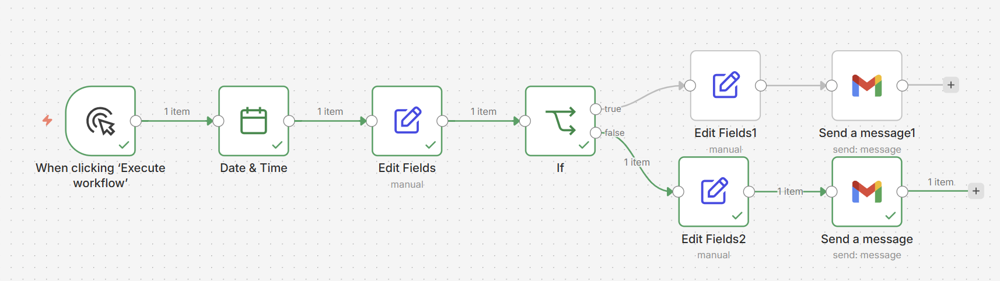
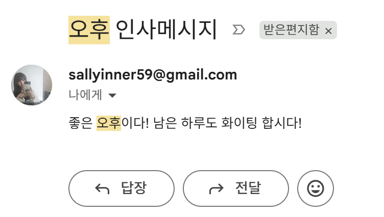

# n8n Time-Based Gmail Auto-Message Workflow

This repository contains a simple n8n workflow designed to automatically send a customized greeting email via Gmail based on the current time of day (AM/PM).

## 🚀 Workflow Overview

This workflow is manually triggered and determines the current time in the `Asia/Seoul` timezone. Based on whether the execution time is in the morning (AM) or afternoon (PM), it crafts a personalized greeting message and sends it to a specified email address.

## ⚙️ How it Works

1. **Manual Trigger**: The workflow starts when you click the "Execute workflow" button in n8n.
2. **Date & Time Node**: Retrieves the current date and time, setting the timezone to `Asia/Seoul`.
3. **Set Fields Node**: Extracts the current hour and determines whether it is `오전` (AM) or `오후` (PM).
4. **If Node**: Branches the flow based on the AM/PM evaluation.
5. **Set Nodes (Messages)**:
   - **AM Branch**: Sets the message to `"즐거운 아침입니다! 오늘도 즐거운 하루 보내세요."` (Good morning! Have a great day today.)
   - **PM Branch**: Sets the message to `"좋은 오후이다! 남은 하루도 화이팅 합시다!"` (Good afternoon! Let's do our best for the rest of the day!)
6. **Gmail Node**: Sends the crafted email to `sallyinner59@gmail.com` with the subject formatted as `[오전/오후] 인사메시지`.

## 📬 Execution Result

Here is an example of the email received when the workflow runs successfully:

## 🛠 Prerequisites

- An active **n8n** instance.
- A **Gmail OAuth2 credential** configured in your n8n workspace to allow sending emails.
